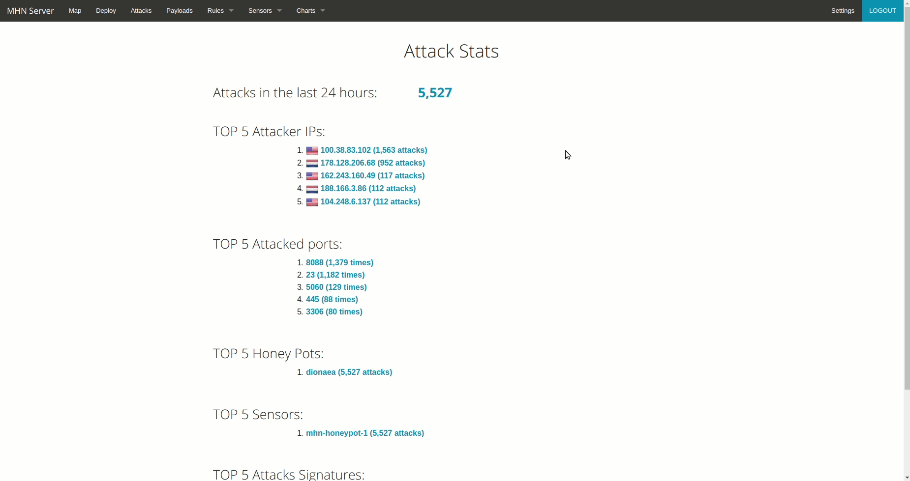

# Project 8 - Honeypot

Time spent: **5** hours spent in total

> Objective: Setup a honeypot and intercept some attempted attacks in the wild.

## Which Honeypot(s) you deployed

Dionaea with HTTP

## Any issues you encountered

The biggest issue was trying to access the MHN Admin console through the given external IP.
I believe opening port 80 on the firewall rules fixed this issue. 

Another issue occured when installing the MHN Admin application. An error appeared stating that a repository couldn't be found.
This was fixed by going into ```/mhn/scripts/install_hpfeeds.sh``` and changing the following lines:

```pip install -e git+https://github.com/HurricaneLabs/pyev.git#egg=pyev```

is changed to:

```pip install -e git+https://github.com/couozu/pyev.git#egg=pyev```

## A summary of the data collected: number of attacks, number of malware samples, etc.

Currently there have been 5,527 attacks as of Novermber 25, 2018 3:46 PM

## A summary of the data collected: number of attacks, number of malware samples, etc. 

None 


